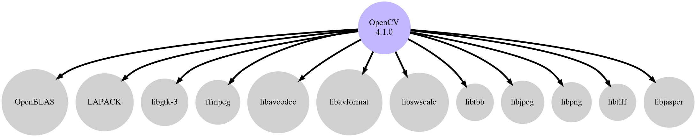

R 3.6.0 - Ubuntu (18.04)
========================

R in Ubuntu's official repo is too old (3.4.0)
I dont trust miniconda, anaconda, etc.

<!---->

## Online resources

Official site:

* [https://www.r-project.org/](https://www.r-project.org/)


## Configure

```bash
CFLAGS="-I/usr/lib/jvm/java-8-openjdk-amd64/include -I/usr/lib/jvm/java-8-openjdk-amd64/include/linux" \
CXXFLAGS="$CFLAGS" \
PREFIX="/opt/R-3.6.0" \
LDFLAGS="-Wl,-rpath,$PREFIX/lib" \
../configure --prefix=$PREFIX \
	--with-blas \
	--with-lapack \
	--with-tcltk \
	--with-gnu-ld
```


## Build, test and install

```bash
make -j 4
make check -j 4
sudo make install
```
